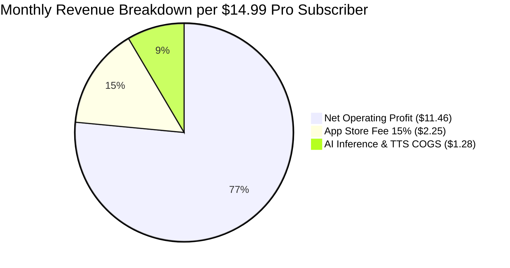
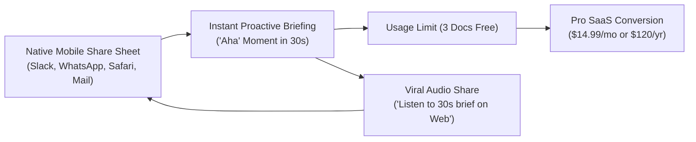

# Distribution Strategy, Business Model & Unit Economics: VoiceQuery

---

## 1. Executive Summary: Does VoiceQuery Have Leverage as a SaaS?

**Yes. VoiceQuery possesses extraordinary leverage as a Prosumer SaaS.**

The business model analysis confirms:
1. **High Willingness to Pay ($14.99/mo to $19.99/mo)**: Target users (investors, executives, consultants, analysts, researchers) value their time at $50–$300+/hour. Saving them 30 minutes a day delivers a >10x immediate ROI.
2. **Software-Grade Gross Margins (>90%)**: On modern infrastructure (Azure AI Foundry `gpt-4.1-mini` + Azure Neural TTS), processing a 20-page document into a proactive spoken brief and multi-turn voice Q&A costs **~$0.032 per document**. A heavy user consuming 40 documents/month generates **$1.28 in monthly COGS**, yielding an **unprecedented 91.5% gross margin on a $14.99/month plan**.
3. **Distribution Advantage via Mobile OS Share Sheet**: Unlike desktop AI tools that require context switching, VoiceQuery leverages the native iOS/Android Share Sheet to turn incoming PDF attachments into audio in 2 taps.
4. **Subscription Superiority Over One-Time Paid App**: Ongoing inference costs (tokens + neural voice synthesis) make a one-time purchase ($9.99) unit-economically fatal for heavy power users. Recurring utility demands recurring SaaS revenue.

---

## 2. Unit Economics & Cost of Goods Sold (COGS)

### 2.1. Per-Document Cost Breakdown (20-Page Technical PDF)

| Component | Service Provider | Volume / Tokens | Unit Price | Cost per Document |
| :--- | :--- | :--- | :--- | :--- |
| **Document Ingestion & Indexing** | Azure AI Foundry (`gpt-4.1-mini`) | ~15,000 input tokens | $0.15 / 1M input tokens | **$0.00225** |
| **Proactive Briefing Generation** | Azure AI Foundry (`gpt-4.1-mini`) | ~150 output tokens | $0.60 / 1M output tokens | **$0.00009** |
| **Voice Q&A Interrogation (3 Turns)** | Azure AI Foundry (`gpt-4.1-mini`) | ~3,500 input + 400 output tokens | Blended rate | **$0.00076** |
| **Executive Briefing Audio (TTS)** | Azure Neural Speech / Speechify API | ~650 characters (35s audio) | $16.00 / 1M characters | **$0.01040** |
| **Spoken Q&A Answers (TTS)** | Azure Neural Speech / Speechify API | ~1,200 characters | $16.00 / 1M characters | **$0.01920** |
| **Total Variable Cost Per Document** | — | — | — | **$0.03270** (~3.3¢) |

### 2.2. Monthly Per-Subscriber Margins ($14.99 / Month Plan)

* **Average Usage Assumption**: 40 documents processed per active month (exceeds typical knowledge worker volume).
* **Monthly Cloud COGS**: $40 \times \$0.0327 = \mathbf{\$1.28 \text{ / user / month}}$.
* **Gross Profit**: $\$14.99 - \$1.28 = \mathbf{\$13.71}$ (**91.5% Gross Margin**).
* **Net Revenue (After 15% Apple/Google Small Business Fee)**: $\$14.99 - \$2.25 - \$1.28 = \mathbf{\$11.46 \text{ net profit / user / month}}$ (**76.5% Net Margin**).

---

## 3. Market Pricing Benchmarks (2025–2026 Prosumer SaaS)

| Product | Positioning | Pricing Model | Benchmark Comparison |
| :--- | :--- | :--- | :--- |
| **Speechify** | Reading assistant & TTS | **$139 / year** (~$11.50/mo) or **$29/mo** | Demonstrates that users willingly pay >$100/yr purely to *listen* to text. Generates ~$18M ARR. |
| **Granola** | AI Meeting Notepad | **$14 / user / month** | Prosumer productivity tool; charges $14/mo for notes from spoken conversations. |
| **Perplexity Pro** | Search & Source Grounding | **$20 / month** | Proves willingness to pay for fast, cited research synthesis. |
| **Superhuman** | Email triage | **$30 / month** | Proves executives pay $30/mo for a tool that saves 30 minutes of cognitive drag daily. |
| **Readwise Reader** | Reading & Highlight Sync | **$9.99 / month** | Bundled reader subscription with high retention among knowledge workers. |

**Takeaway**: Pricing VoiceQuery at **$14.99/month ($120/year)** places it right in the sweet spot between reading tools ($9.99/mo) and executive productivity tools ($20–$30/mo).

---

## 4. Packaging & Tiering Strategy

According to RevenueCat's **2026 State of Subscription Apps** report, AI apps convert trials to paid subscriptions at **8.5%** (52% higher than non-AI apps). However, loose, unrestricted freemium models convert at only **2.1%**, while gated paywalls convert at **10.7%**.

We therefore adopt a **Usage-Gated "Aha-Moment" Freemium model**:

| Tier | Price | Quotas & Value Gate | Strategic Objective |
| :--- | :--- | :--- | :--- |
| **Free / Trial** | **$0** | • **3 documents per month** • Standard on-device TTS audio • 30s executive audio briefings • Basic voice interrogation | **Top-of-Funnel Viral Hook**: Let the user experience their own PDF speaking an executive briefing aloud in < 30 seconds. |
| **VoiceQuery Pro** *(Primary SaaS)* | **$14.99 / mo** *(or $120 / yr)* | • **Unlimited documents & web articles** • **Ultra-realistic Azure Neural Voices** • Unlimited hands-free voice dialogue • Audio briefing export (sync to podcast app / Apple Watch) • Verified page citation history & notes | **Core Monetization**: Converts active commuters, executives, and researchers into high-retention annual subscribers. |
| **Teams & Workspaces** | **$35 / seat / mo** | • Shared team document repositories • Private enterprise Azure AI tenant (zero data retention) • SOC2 / HIPAA compliance • Integrations (Notion, Google Drive, OneDrive, Slack) | **Enterprise Expansion**: Institutional sales to investment funds, consulting firms, and legal boutiques. |

---

## 5. Distribution & Customer Acquisition Channels

### 5.1. Channel 1: The Native OS Share Sheet (The Invisible Funnel)
* **Mechanism**: Users don't need to change their workflow. When an email or Slack message arrives with an attached 40-page deck:
  - User taps: *Share $\rightarrow$ VoiceQuery*.
  - While they put their phone in their pocket and walk to their car, the audio briefing starts playing through their AirPods.
* **Friction**: Near zero. No opening websites, no dragging files, no typing prompts.

### 5.2. Channel 2: Viral Audio Briefing Snippets ("Voice Memos for Work")
* **Mechanism**: After listening to a 35s briefing of an earnings report or project spec, the user can tap: *"Share Audio Briefing to Slack/WhatsApp"*.
* **Recipient Experience**: Team members receive a high-fidelity 30-second audio note with a lightweight web player: *"Summarized by VoiceQuery — Tap to ask questions aloud"*.
* **Growth Loop**: Every shared briefing acts as an organic acquisition ad for colleagues.

### 5.3. Channel 3: App Store Optimization (ASO) & Search Intent
* **High-Intent Keywords**:
  - *"Chat with PDF voice"*
  - *"Audio PDF reader"*
  - *"NotebookLM mobile alternative"*
  - *"Listen to documents"*
  - *"AI executive summary voice"*

---

## 6. Retention & Combating "AI App Churn"

RevenueCat data shows that generic AI wrapper apps suffer from high 12-month churn (retention of ~21%). To ensure long-term LTV and enterprise durability, VoiceQuery incorporates three retention mechanisms:

1. **Habitual Trigger (Commuting & Exercise Rhythm)**:
   - VoiceQuery hooks into a daily physical ritual (the morning drive, the train commute, walking between meetings, the gym). Habitual audio consumption has dramatically lower churn than desktop chat utilities.
2. **Contextual Knowledge Graph**:
   - As users accumulate documents (e.g. Q1, Q2, Q3 earnings, past contracts), VoiceQuery remembers cross-document context (e.g., *"How does this quarter's operating margin compare to the report I uploaded last month?"*).
3. **Zero-Touch Audio Queue (Playlist Mode)**:
   - Users can queue up 3 documents in the morning and have VoiceQuery play back-to-back executive briefings sequentially without ever touching their phone.

---

## 7. Conclusion

VoiceQuery is not a one-time utility—it is a **daily executive productivity companion**. With **91.5% gross margins**, a **$14.99/month price point**, and the **mobile Share Sheet as a friction-free acquisition engine**, the product has all the necessary leverage to succeed as a high-margin, scalable SaaS.
