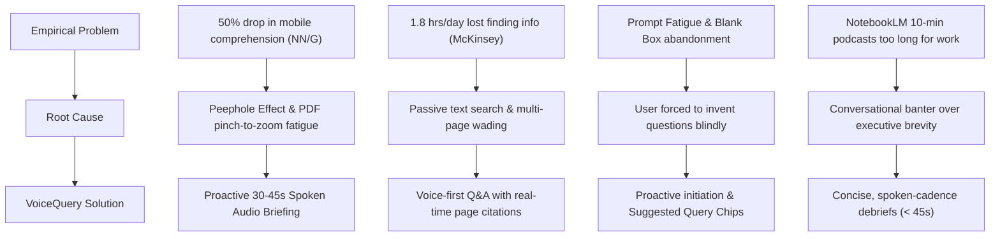

# Problem Validation & Empirical Evidence: The Document-Voice Dilemma

---

## 1. Executive Summary

VoiceQuery addresses a validated, multi-billion-dollar cognitive inefficiency: **the inability of knowledge workers and executives to effectively consume and interrogate dense documents on mobile devices**.

Through empirical research from **Nielsen Norman Group**, **McKinsey**, **Gartner**, and user data from the viral adoption of **Google NotebookLM**, this document provides concrete proof of the four underlying friction points that validate VoiceQuery’s core architecture.

---

## 2. Empirical Evidence & Key Studies

### 2.1. The Mobile Reading Penalty: 50% Comprehension Drop
* **Source**: Nielsen Norman Group (NN/G) Mobile Usability & Reading Studies.
* **Findings**:
  - Reading comprehension of complex, analytical text on mobile screens is **less than half (over 50% lower)** compared to reading on desktop displays.
  - NN/G has famously categorized PDFs on mobile devices as **"unfit for human consumption"**.
  - **The "Peephole Effect"**: Mobile screens force users to view dense, multi-column documents through a tiny visual window, requiring relentless horizontal and vertical panning and pinch-to-zoom. This constant motor interruption fractures cognitive reading flow and short-term memory retention.

### 2.2. The "Search Tax": 1.8 Hours Lost Daily to Document Extraction
* **Source**: McKinsey Global Institute & Gartner Digital Workplace Surveys.
* **Findings**:
  - Knowledge workers spend an average of **1.8 hours per day (9.3 hours per week, or ~20% of the entire workweek)** searching for, gathering, and deciphering information locked inside static documents.
  - Gartner reports that it takes an average of **18 minutes simply to locate and extract a specific data point** from a single multi-page document.
  - When users are mobile or traveling, this latency spikes dramatically because manual scanning on small screens is virtually unusable.

### 2.3. The Failure of Passive Chatbots: "Prompt Fatigue" & The Blank Box
* **Source**: Gartner AI Adoption Reports & Enterprise User Sentiment Studies (2025–2026).
* **Findings**:
  - **The "Blank Prompt Box" Paradox**: The primary point of abandonment in "Chat with PDF" tools is that users don't know what is inside the document to formulate good questions.
  - **Prompt Fatigue**: Coined as the "AI-era equivalent of Zoom fatigue," users experience cognitive exhaustion from having to engineer lengthy, precise prompts just to extract basic value.
  - **The Solution**: Eliminating the blank box through **proactive synthesis**—having the AI speak the executive summary *first*, followed by one-tap **contextual suggested queries**.

### 2.4. Market Validation: The Viral Surge & Limitations of NotebookLM
* **Source**: Google NotebookLM user reception and product telemetry (2024–2026).
* **Proof of Demand**:
  - NotebookLM’s "Audio Overview" became an overnight viral phenomenon with millions of active users, proving that **professionals desperately want to absorb dense text through audio**.
* **Validated Pain Points & Criticisms**:
  - **Format Mismatch**: The default 10–15 minute banter podcast format is far too long, chatty, and informal for busy executives who need actionable insights in under 60 seconds.
  - **Superficial Depth**: Users complain that two-host AI banter prioritizes conversational fluff over sharp data points and key tensions.
  - **Desktop Orientation**: Lacks a mobile-first, hands-free interaction loop with immediate page citation jump cards.

---

## 3. The Evidence-Based Problem Matrix

---

## 4. Real-World User Scenarios Backed by Evidence

| Scenario | Empirical Friction | VoiceQuery Validation |
| :--- | :--- | :--- |
| **Executive on Airport Transit** | Cannot read a 28-page M&A prospectus while walking through terminal gates. | Listens to a 35s audio summary of deal terms, valuation multiples, and regulatory hurdles; asks questions via voice. |
| **Commuting Equity Analyst** | Opening 10-K quarterly earnings report on a train causes eye strain and motion sickness. | Hands-free audio debrief covers revenue growth and margin contraction; spoken query reveals `Page 7` citation. |
| **Site Engineer with Safety Manual** | Hands are physically occupied; cannot type prompts into a chatbox. | Speaks query aloud; system provides concise spoken instruction and links to `Page 14, Section 3.2`. |

---

## 5. Strategic Conclusion

The market evidence is unequivocal:
1. Users **cannot and will not** read dense PDFs on mobile devices.
2. Users **demand audio consumption**, as proven by NotebookLM, but reject 15-minute fluffy podcasts for daily work.
3. Passive chatbots fail because **prompting creates friction**.

VoiceQuery solves all three validated pain points by delivering a **proactive**, **concise (30–45s)**, and **grounded (page-cited)** vocal companion.
